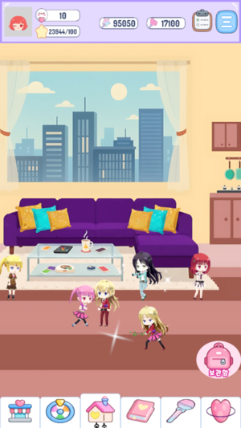
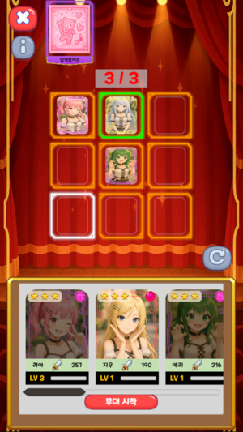
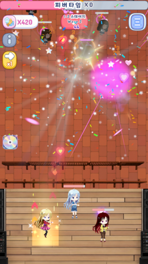
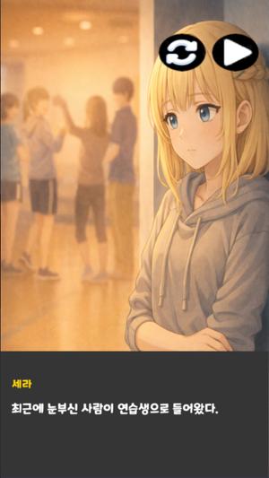

# 💖 하트스테이지 (Heart Stage)

> K-POP 아이돌 테마 **2D 캐주얼 타워 디펜스 게임**
> 악마에 홀린 사람들을 아이돌 공연으로 정화하라!

---

## 📌 프로젝트 개요

* **장르**: K-POP 아이돌 테마 2D 캐주얼 타워 디펜스
* **플랫폼**: Android (Google Play Store 출시)
* **개발 형태**: 기업협약 팀 창작 게임 프로젝트
* **개발 기간**: 8주 (2025.11.07 ~ 2026.01.06)
* **개발 인원**: 프로그래머 3명, 기획자 3명
* **개발 환경**: Unity 6.0 (6000.0.60f1), C#, Firebase, Git, Notion, Discord

---

## 🎮 게임 소개

`하트스테이지`는 **악마에 홀린 사람들을 아이돌 공연으로 정화한다**는 컨셉의 2D 캐주얼 타워 디펜스 게임입니다.

플레이어는 캐릭터의 **패시브 범위를 고려한 최적 포지션 배치**와 **스킬 사용 타이밍**을 직접 조절하며, 캐릭터 수집 · 의상 커스터마이징을 통해 나만의 아이돌 팀을 구성합니다.

---

## 🕹 핵심 플레이

### ▶ 스테이지 디펜스

* 웨이브 기반 전투 진행
* 캐릭터 공격 및 스킬 발동, 보스 패턴 대응
* 승리 / 패배 판정

### ▶ 캐릭터 배치 & 시너지

* 스테이지 입장 전 캐릭터 배치
* 범위 패시브 버프, 시너지 버프 효과 적용

---

## 🧩 주요 시스템

* **전투**: 기본 공격 / 액티브 스킬, 적 AI, 아이템·경험치 드랍
* **캐릭터 관리**: 상세 정보창, 강화, 도감, 의상·포토카드 변경
* **메타 콘텐츠**: 상점, 인벤토리, 숙소(행동 애니메이션·호감도), 전투 파견, 스테이지 선택
* **온라인 & 서비스**: 이메일/익명 로그인, 세이브, 친구·메신저, 친구 숙소 방문, 프로필·우편함·퀘스트·공지사항
* **사운드 & 연출**: AI 대사 사운드, UI 효과음, 숙소 연출

---

# 🧑‍💻 담당 파트 (김의중 · Unity 클라이언트)

## 1. 커스텀 에디터 툴

기획자가 Unity 에디터에서 직접 밸런싱·레이아웃·패시브 범위를 조정할 수 있도록 **4종의 커스텀 에디터**를 설계 및 구현했습니다.

### 🔹 밸런스 에디터

* **8종 데이터 단일 에디터 통합** (Character / Monster / Skill / Item / Stage / StageWave / Synergy / InfiniteStage)
* **CSV ↔ ScriptableObject 양방향 동기화** 구현
* **Addressables 자동 파이프라인**: CSV Import 시 SO 생성 + 자동 주소/라벨 등록 (StageAssets, CharacterData) → 수동 등록 제거, 빌드 안정성 확보
* **플레이모드 재진입 제거**로 밸런싱 반복 주기 단축

### 🔹 스테이지 에디터

* **실시간 스테이지 상태 모니터링**으로 디버깅 효율 향상
* **웨이브 점프 기능**: 이전/다음 점프, 웨이브 직접 입력 지원
* **스테이지 즉시 진입**: 로비 → 선택 → 배치 과정 생략, 드롭다운/ID 입력으로 원하는 시점 즉시 이동
* **모든 몬스터 즉시 클리어**, 씬 리로드로 빠른 재시작

### 🔹 스테이지 레이아웃 에디터

* **5x3 그리드 시각화**로 배치 슬롯 구조 직관적 편집
* 타일 클릭으로 활성/비활성 즉시 토글
* **프리셋 제공**: 전체 선택 / 중앙 3x3 / 가운데 열 원클릭 구성
* 활성 슬롯 데이터 자동 갱신 → **기획자 직접 편집으로 개발 병목 제거**

### 🔹 캐릭터 패시브 범위 에디터

* **9x5 확장 그리드**로 게임 영역 안팎까지 스킬 범위 자유 설정
* 게임 내 범위와 바깥 영역 색 구분으로 오배치 방지
* 좌표 대신 그리드 타일 클릭으로 스킬 영향 범위 즉시 설정
* 10명 캐릭터 패시브 범위 조정마다 발생하던 **반복 개발 요청을 에디터 도입으로 제거**

---

## 2. 캐릭터 배치 기능

* **배치 중 패시브 범위 시각화**: 현재 캐릭터의 패시브 범위를 색으로 표현
* **배치 중 위치 변경** 기능
* **시너지 표시**: 3명 이상 배치 시 시너지 조건 충족 여부를 상단에 실시간 표시

---

## 3. 캐릭터 커스터마이징

* **파츠 분리 시스템**: 상의 / 하의 / 신발 에셋을 파츠별로 구분해 조합 가능
* **보유 중인 옷만 표시 / 착용 가능**하게 필터링 구현
* **다른 유저 숙소 방문 시** 해당 유저가 설정한 커스터마이징이 그대로 노출
* 게임 내 캐릭터가 등장하는 **모든 씬에 일관 적용**

---

## 4. Firebase 연동

* **공지사항**: Firebase에서 작성한 공지를 게임 내 공지 UI로 실시간 반영
* **점검 시스템**: 서버 점검 on/off, 시작/종료 시간, 잔여 시간 표시
* **친구 시스템**: Firebase 기반 친구 추가 / 요청 / 관리

---

## 🔧 플레이 방법

* 최초 실행 시 리소스 다운로드 후 로딩 약 10초 소요
* 로그인 화면에서 익명 로그인 또는 이메일 회원가입 후 플레이
* 로비 상단 아이콘에서 프로필·퀘스트·옵션 확인
* 숙소에서 캐릭터 선택 시 호감도 기능 확인 가능

---

## 🖼️ 스크린샷

| 로비 | 배치 | 전투 | 스토리 |
|------|------|------|------|
|  |  |  |  |

---

## 🔗 링크

* **Google Play Store**: https://play.google.com/store/apps/details?id=com.kyungil.heartstage
* **시연 영상**: https://youtu.be/fAtMNnIuqd8

---

## 👤 Contact

**김의중** · Unity 클라이언트 프로그래머
📧 htp31698@naver.com · 📱 010-3474-3569
